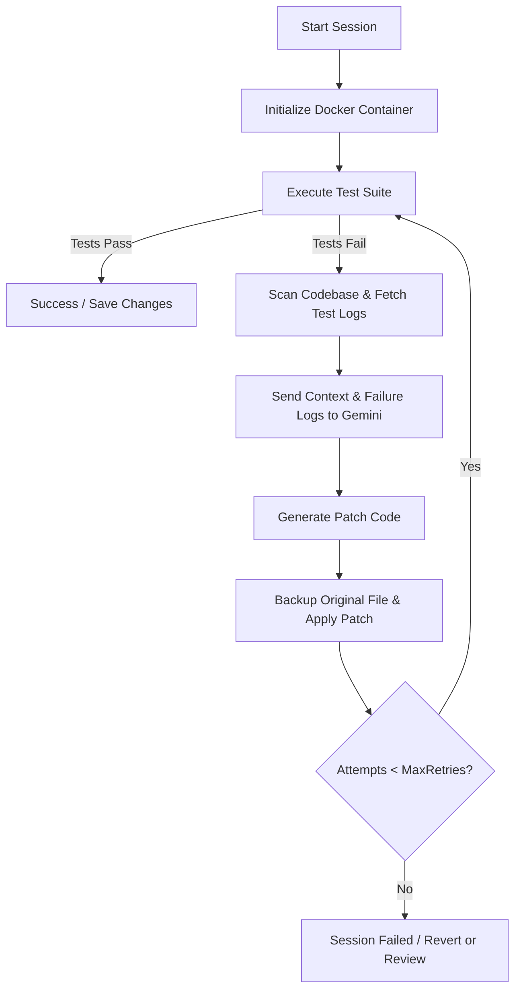

# 🤖 Self-Healing Autonomous Coding Agent

An advanced, Docker-sandboxed DevOps agent that automatically detects test failures, analyzes codebase context using the Gemini LLM, generates precise patches, and iterates until all tests pass.

---

## 🌟 Key Features

* **🐳 Docker-Sandboxed Testing:** Safely runs test suites inside isolated Docker containers (`node:20-alpine` by default) to protect host resources.
* **🧠 Gemini LLM Integration:** Powered by the `@google/genai` library, it uses advanced code reasoning to spot bugs, plan fixes, and generate drop-in patches.
* **🔄 Self-Healing Loop:** Automatically loops through the `run tests` -> `send error to LLM` -> `apply patch` sequence until all test suites pass or `MAX_RETRIES` is reached.
* **📡 Real-Time SSE Log Streaming:** Stream the agent's execution states (e.g., test outputs, LLM logs, and original-vs-fixed code diffs) directly to the web dashboard in real time.
* **💻 Interactive Code Playground:** Generate and preview code instantly via the built-in AI code-gen playground.

---

## 🏗️ Architecture & Workflow

The self-healing flow operates as follows:



---

## 📁 Project Structure

```text
├── core/
│   ├── orchestrator.js      # Main self-healing loops (Direct & Docker modes)
│   └── state-manager.js     # Manages backups and file-system state
├── docker-runner/
│   ├── container-manager.js # Manages starting/stopping Docker containers
│   └── executor.js          # Handles executing test commands inside Docker
├── llm/
│   ├── client.js            # Interfaces with Google Gemini API
│   └── prompts/
│       ├── direct-code-gen.js
│       └── fix-prompt.js    # System & User prompts for bug fixing
├── config/
│   └── settings.js          # Environment variable loaders
├── public/                  # Web dashboard UI files (HTML, CSS, JS)
├── server.js                # Main Express server with REST APIs & SSE
├── test-orchestrator.js     # Verification script for local debugging
├── .gitignore               # Excludes secrets, node_modules, and logs
└── package.json             # Node dependencies and execution scripts
```

---

## 🚀 Getting Started

### 📋 Prerequisites

Ensure you have the following installed on your system:
- **Node.js** (v18+)
- **Docker** (running locally)
- A **Gemini API Key** from [Google AI Studio](https://aistudio.google.com/)

---

### ⚙️ Installation & Configuration

1. **Clone your repository:**
   ```bash
   git clone https://github.com/Kaushikrudra/autonomous-coding-agent.git
   cd autonomous-coding-agent
   ```

2. **Install Node.js dependencies:**
   ```bash
   npm install
   ```

3. **Configure Environment Variables:**
   Create a `.env` file in the root directory:
   ```env
   PORT=3000
   GEMINI_API_KEY=your_gemini_api_key_here
   GEMINI_MODEL=gemini-2.5-flash
   MAX_RETRIES=3
   DOCKER_IMAGE=node:20-alpine
   DOCKER_SOCKET_PATH=/var/run/docker.sock
   ```

---

### 🏃 Running the Application

#### 1. Start the Web Dashboard Server
To start the dashboard backend:
```bash
npm start
```
Then, open your browser and navigate to `http://localhost:3000` to start self-healing sessions.

#### 2. Run Local Verification / Test Scripts
To run the automated verification script (which intentionally creates a bug in a sample project and lets the orchestrator heal it):
```bash
npm run test-orchestrator
```

Or run separate components manually:
```bash
npm run test-runner  # Tests docker runner integration
npm run test-llm     # Tests LLM connection and responses
```

---

### 💻 AI Code Generator Playground

The project includes an interactive playground specifically built for code generation and rendering:

* **Route:** Navigate to `http://localhost:3000/generate` in your web browser.
* **Capabilities:**
  * **Text-to-Code Generation:** Write a natural language prompt and choose a language (JavaScript, Python, C++, Java, Go, Rust, HTML, CSS) to generate code instantly.
  * **AI Explanations:** Read context and logical breakdown generated by the Gemini model alongside the code.
  * **Live Preview & Execution:** Run the generated code. HTML/CSS code renders directly inside a sandboxed live preview iframe, while other languages support output printing.
  * **One-Click Actions:** Copy code directly to your clipboard or download it as a script file.

---


## 🛡️ License

This project is licensed under the ISC License. See the [package.json](package.json) file for details.
